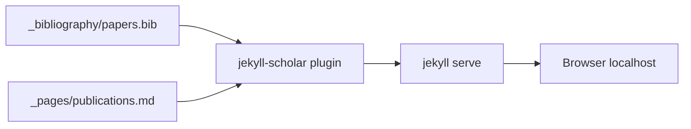

# Local Testing Guide for [dsondak.github.io](http://dsondak.github.io)

## What you have

This repo is a **Jekyll** static site using the **al-folio** academic theme. Key facts:

- Dependencies are declared in `[Gemfile](Gemfile)` (Jekyll, jekyll-scholar, jekyll-imagemagick, etc.)
- CI deploys with **Ruby 3.2.2** and `bundle exec jekyll build` (`[.github/workflows/deploy.yml](.github/workflows/deploy.yml)`)
- There is **no `Gemfile.lock`** in the repo (it is excluded from the build), so dependencies are resolved fresh on install
- Publications are driven by `[_bibliography/papers.bib](_bibliography/papers.bib)` and rendered on `[_pages/publications.md](_pages/publications.md)` via **jekyll-scholar**




---

## Option A: Docker (recommended on Windows)

The repo ships two Docker configs:


| File                                       | Purpose                                                                     |
| ------------------------------------------ | --------------------------------------------------------------------------- |
| `[docker-compose.yml](docker-compose.yml)` | Uses prebuilt image `amirpourmand/al-folio` (fastest start)                 |
| `[docker-local.yml](docker-local.yml)`     | Builds from `[Dockerfile](Dockerfile)` locally (if prebuilt image is stale) |


**Steps:**

1. Install [Docker Desktop](https://www.docker.com/products/docker-desktop/) and ensure it is running.
2. From the repo root (`C:\Users\dsk3\dsondak.github.io`), start the server:

```powershell
docker compose up
```

Or, to build locally instead of pulling the prebuilt image:

```powershell
docker compose -f docker-local.yml up --build
```

1. Open **[http://localhost:8080](http://localhost:8080)** in your browser.
2. To preview publications specifically: **[http://localhost:8080/publications/](http://localhost:8080/publications/)**
3. The container runs with `--watch` and `--livereload`, so edits to `.md`, `.bib`, and other source files should auto-rebuild.
4. Stop with `Ctrl+C`, then optionally `docker compose down`.

**Note:** The Docker entrypoint deletes `Gemfile.lock` on each start (see `command` in docker-compose) and runs `bundle install` inside the container — you do not need Ruby installed on Windows.

---

## Option B: Native Ruby + Bundler

Use this if you prefer not to use Docker or already have Ruby set up.

**Prerequisites:**

- **Ruby 3.2.x** (matches CI)
- **Bundler** (`gem install bundler`)
- **ImageMagick** (required by `jekyll-imagemagick` in the Gemfile). On Windows, install via [ImageMagick](https://imagemagick.org/script/download.php) or `winget install ImageMagick.ImageMagick`.

**Steps:**

1. From the repo root:

```powershell
$env:Path = "C:\Ruby32-x64\bin;" + $env:Pat
bundle install
bundle exec jekyll serve --livereload
```

1. Open **[http://localhost:4000](http://localhost:4000)** (Jekyll's default port; Docker uses 8080 instead).
2. Publications page: **[http://localhost:4000/publications/](http://localhost:4000/publications/)**

**First-run gotcha:** If `bundle install` fails on native extensions (e.g. `mini_racer`), Docker (Option A) avoids most Windows Ruby toolchain pain.

---

## Verifying the site works

After the server starts, confirm:

1. **Home/about page** loads at `/`
2. **Publications page** loads at `/publications/` and shows entries grouped by year
3. **No build errors** in the terminal — jekyll-scholar will fail loudly if `papers.bib` has syntax errors

To do a production-style check (same as GitHub Pages deploy):

```powershell
bundle exec jekyll build
```

Output goes to `_site/`. CI also installs `mermaid.cli` globally for diagram posts; you only need that if you edit posts using Mermaid diagrams.

---

## When you add publications (next step)

You will not need to change the testing workflow — only the content:

1. Add BibTeX entries to `[_bibliography/papers.bib](_bibliography/papers.bib)`
2. Add any new years to the `years:` list in `[_pages/publications.md](_pages/publications.md)` (currently tops out at `2024`)
3. Refresh the local server and check `/publications/`

Optional per-entry metadata (PDF links, badges, "selected" flag) uses custom BibTeX fields documented in al-folio; see `[_config.yml](_config.yml)` `filtered_bibtex_keywords` for supported fields like `pdf`, `html`, `code`, `selected`.

---

## Quick reference


| Method               | Command                                         | URL                                            |
| -------------------- | ----------------------------------------------- | ---------------------------------------------- |
| Docker (prebuilt)    | `docker compose up`                             | [http://localhost:8080](http://localhost:8080) |
| Docker (local build) | `docker compose -f docker-local.yml up --build` | [http://localhost:8080](http://localhost:8080) |
| Native Ruby          | `bundle exec jekyll serve --livereload`         | [http://localhost:4000](http://localhost:4000) |
| Production build     | `bundle exec jekyll build`                      | output in `_site/`                             |


